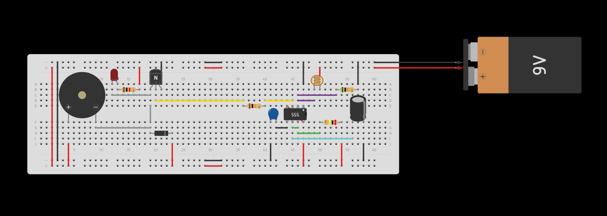

# Time-Delayed Laser Trap Alarm 🚨

## Description
This project is a hardware-based security system that triggers an alarm when a laser beam is interrupted. It features a custom time-delay mechanism using a 555 timer IC, ensuring the alarm sounds for a specific duration even if the laser connection is quickly restored. It is designed purely with hardware components, requiring no microcontroller.

## Features
* **Instant Trigger:** Uses a Light Dependent Resistor (LDR) to detect breaks in the laser beam instantly.
* **Time Delay Logic:** The system is configured in monostable mode, keeping the alarm active for ~2.2 seconds after the initial trigger.
* **Cost-Effective & Reliable:** Built with standard, accessible electronic components.

## Bill of Materials (BOM)
* 1x 555 Timer IC
* 1x LDR (Light Dependent Resistor)
* 1x 10uF Capacitor
* 1x 200k Ohm Resistor
* 1x Laser Pointer
* 1x Active Buzzer / LED (for alarm output)
* Breadboard & Jumper wires
* Power Supply (e.g., 5V or 9V battery depending on component ratings)

## Circuit & Timing Logic
The core of this project is the 555 Timer wired in **Monostable Mode**. The duration of the output pulse (the time the alarm stays on) is determined by the RC network (Resistor and Capacitor) connected to the timer.

The timing calculation is based on the standard formula:
T = 1.1 * R * C
T = 1.1 * 200,000 ohms * 0.000010 Farads
T = 2.2 seconds

This means once the laser is broken, the alarm will sound for exactly 2.2 seconds before resetting automatically.

## Simulation & Schematics
* The circuit logic was designed and simulated using **Tinkercad**.
* 🔗 [Click here to view and simulate the project on Tinkercad](https://www.tinkercad.com/things/jt056t19AAm-lazer-tuzak?sharecode=UQNEb5gYcyAz59GBrCQAJ1W2fc1zEdOkbmRFk5aGVB8)
* The complete schematic diagram can be viewed in the `laser_alarm.pdf` file included in this repository.

### Circuit Preview

## Installation / Usage
1. Assemble the circuit according to the provided schematic diagram.
2. Power up the circuit.
3. Fix the laser pointer so it aims directly at the LDR.
4. Once the beam is broken by an object or person, the LDR resistance spikes, triggering the 555 timer.
5. The buzzer will sound for the calculated delay period.
